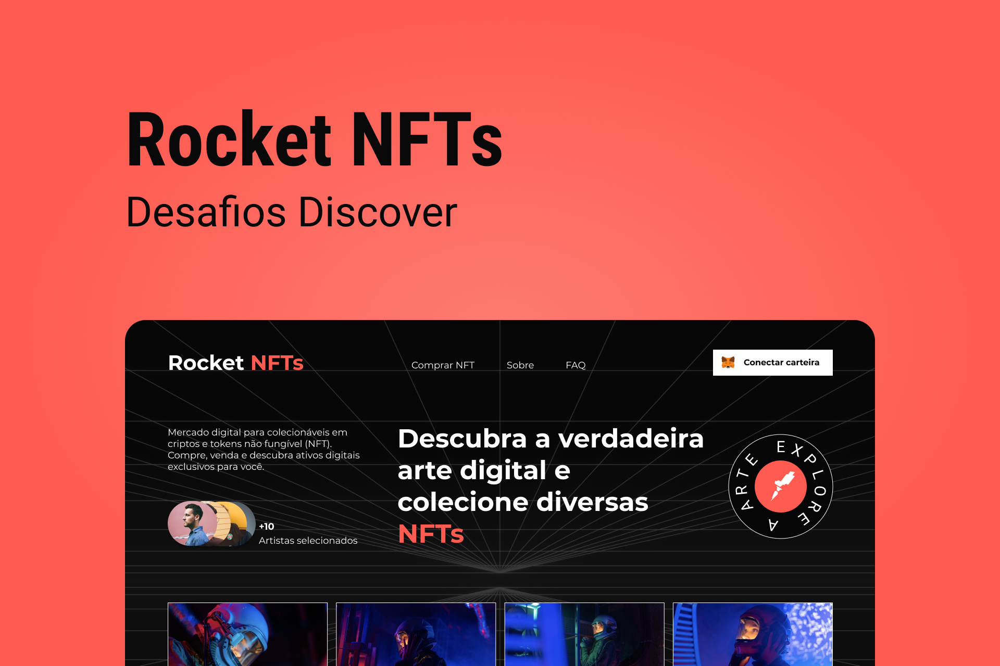

# Rocket NFTs

> Construction of the Rocket NFTs home page, with React and TailwindCSS, was a challenge proposed by Rocketseat.
> To make the animations, I used Tailwind's `tailwind.config.js` file to create custom animations, such as the Marquee effect.
> I also used the React Reveal library, to add animations when scrolling.
